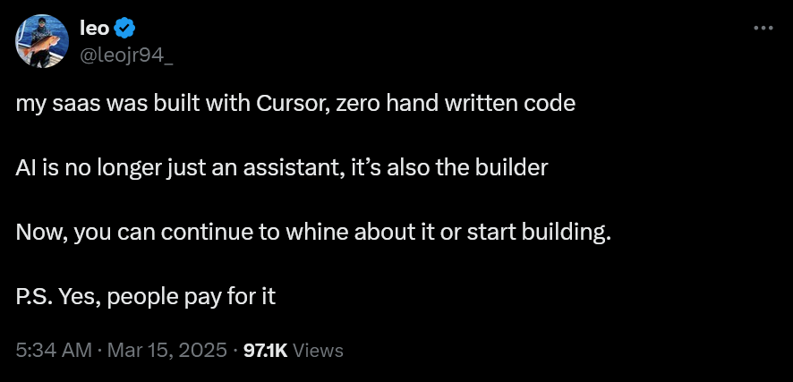

When we discovered how to create fire, it propelled us forward like no other discovery in the history of mankind. Whether as a source of light and warmth, protection from predators or as a method of cooking food, the ways in which fire has allowed us to evolve as a race are undeniably incredible. When we discovered how to make stone tools, we were suddenly able to cut things, create better weapons and protect ourselves better. What's even more incredible, all of that came before we even invented language - a feat, that, to our knowledge, no other race has achieved to this very day. To add to that, we then also invented a way of keeping record of what happened, using glyphs associated with our made up sounds. Be it better tools using Bronze and Iron, Ships, Mathematics, the compass, or heck, even the f\*\*\*king wheel, there have been countless inventions that have pushed us and the way we go about things and think about things forward.

One could argue that, when James Watt invented the Steam Engine, it all started going downhill. But I'm no hermit, I actually enjoy technology. Trains, the Telephone, Electricity, doesn't matter what it is, I won't deny we live in an incredibly advanced world, and I am grateful for every invention that some human being has poured their heart into. Especially when computers and the internet were invented in the 20th century, the world changed forever. Global communication at the literal speed of light was probably not on most researchers' bingo cards, yet here we are.

I don't have to beat around the bush further. You've read the title - this article is about artificial intelligence. If you're a tech-savvy person like me, you might be wondering why Artificial Intelligence is not on my list of the "Top 10 Greatest Inventions of Mankind". Truth be told, the actual theory behind AI and the way it works fascinates me to this day. But that doesn't mean I can't be critical about it.

To be frank - I've grown to despise AI. The irony of me asking ChatGPT "What are the greatest inventions of man in chronological order" isn't lost on me. After all, AI may just be the "Electricity Moment" of our generation. And it's rise to popularity is incredible, I won't deny that. Becoming the #1 downloaded app on the App Store is no small feat, and ChatGPT absolutely smashed that benchmark. I think it's fair to say that life without AI, even though it's only been here for around three years, is pretty unimaginable. Students use it to ~~cheat~~ learn for exams, companies use it to simplify workflows, programmers use it to complete the simpler tasks. But how did we get here?

Artificial Intelligence, at least as a concept, has always been around us humans. Even in antiquity, where myths and stories told of artificial beings with intelligence that were created by master craftsmen. There was, for example, Talos, a bronze giant forged by Hephaestus, the Greek god of blacksmiths, who protected the island of Crete by throwing boulders at invading ships.[^1] Another prominent story of an artificial being created by man is described in the book "Of the Nature of Things" by Paracelsus, a Swiss alchemist. He wrote that, by placing the "sperm of a man" in horse dung and feeding it the "Arcanum of Mans blood" after 40 days, a living infant would be created. To flex my German roots a bit, in Goethe's Faust: The Second Part of the Tragedy (Der Tragödie zweiter Teil in fünf Akten), a fabricated homunculus, living in a flask in which it was created, wants to be born into a real human body. I'll spare you the details. As any other Germans will know, Faust isn't exactly the easiest read.

This idea of artificial creations with the ability to reason was later picked up by philosophers of various origins. Ramon Llull, a Spanish philosopher, even developed multiple "logical machines" which he described as being able to combine basic and undeniable truths by simple logical operations. It was thus, according to him, able to produce all the possible knowledge[^2]. His ideas were later picked up on by German mathematician and philosopher Gottfied Leibniz, who speculated that human reason could be reduced to mechanical calculation. He envisioned a *characteristica universalis*[^3]a formal language in which mathematical, scientific and metaphysical concepts could be expressed. Based on the theories of Leibniz, Hobbes and Descartes, the study of mathematical logic then provided a breakthrough that made artificial intelligence seem plausible. In 1913, Bertrand Arthur William Russel and Alfred North Whitehead published what Wikipedia calls their "masterpiece", a book called *Pricipia Mathematica*, which essentially presented a formal treatment of the foundations of mathematics.[^4] I'll spare you the details of how we got to the eventual breakthroughs, but we've now basically arrived at the Turing machine, a mathematical model of computation that, despite its simplicity, is capable of implementing any computer algorithm.

The first real "computers" started popping up during the second world war. Then used to decipher war messages, they later evolved into research machines. When neurologists discovered that the brain was an electrical network of neurons that fired in all-or-nothing pulses, many noticed the similarities to Alan Turing's theory of computation - that any form of computation could be described digitally with ones and zeroes. Artificial Intelligence Research was officially founded as an academic discipline in 1956.[^5]

Skip forward to 1972, and Alain Colmerauer designed Prolog, the first logical programming language. Contrary to functional-based programming, it's goal was to make artificial intelligence a real thing, by providing it with all the needed information (predicates) and then "asking it questions" based on these predicates. It was used to create "[Expert Systems](https://en.wikipedia.org/wiki/Expert_system)", essentially an early form of AI agents that would be incorporated by many corporations around the world. These expert systems lead to the first Boom of AI research during the 1980s, where spending increased from a few millions to billions of dollars.[^6]

The excitement was short-lived - by the end of the 1980s, all hype around expert systems had died down, as they proved too expensive to maintain. It would take another few years until the technology and algorithms that were developed by AI researchers found their way into parts of larger systems, the biggest early example of such an adoption being Google's search engine. As Nick Bostrom, a Swedish philosopher said: "A lot of cutting edge AI has filtered into general applications, often without being called AI because once something becomes useful enough and common enough it's not labeled AI anymore."[^7]

What we now know as AI really only became possible due to the large amounts of data that were made accessible through the internet. In the 2010s, companies like OpenAI and Google DeepMind were the ones to push research on AI forwards by iterating on techniques like deep learning and algorithms like the transformer model, the fruits of their labor paying off when the second AI boom started in 2020.

We're basically all caught up now. I said earlier that I have grown to despise AI, and you might be confused as to why that is. After all, it's become a cornerstone of our daily lives. I'll be the first to admit that, when working on something and running into issues, I don't pull up Google anymore, I ask ChatGPT, because it's more convenient. But exactly therein lies my issue. Convenience.

The 2008 science fiction film WALL-E depicts the planet Earth as a wasteland, filled with garbage due to rampant consumerism and corporate greed. Humanity was forced to escape to space on giant spaceships, leaving earth to rot and a few trash-compacting robots to clean up their mess. The movie itself is really cute - the last remaining trash robot has developed sentience, and when the humans send down a modern robot to check on the planet, he falls in love with her. It's worth a watch, I definitely recommend it. But the reason I find so interesting is not because of the way the environment is depicted. When WALL-E and EVE (the robot he falls in love with) return to the spaceship the humans live in, it becomes apparent that the humans aboard have degenerated into obese lazy beings. Robots handle everything for them, and the ship is entirely controlled by a rogue AI that won't allow the humans to return to earth even when EVE returns with evidence of life on the planet.

Call me silly, but I think that this degradation of human life and intelligence is not only possible - it has already begun. For me, it is most notable in my fellow developers I talk to every day. Whereas a few years ago you had to go on an expedition into the far-away land they call "StackOverflow", you now just pull up ChatGPT to solve the issue for you. In fact, you might not even start coding yourself - ChatGPT (or your AI agent of choice) will just scaffold the project for you. There's a chat integrated into the IDE of your choice, you've got inline code completions where you just hit a key and all the code is generated for you, it writes the documentation, takes in the context of your entire codebase and might as well just tell you what the next steps for your big project are. That is NOT a helpful assistant - that is an authority telling you what to do. And I have a problem with it.

"Vibe Coding" is one of those terms that were coined this year. But contrary to the usual linguistic nonsense that gets spat out by social media these days I think it gets the point across very well. I won't even try to grab the official definition for this. Vibe Coding is basically the process of having an AI code for you. At first glance it's an opportunity for anyone to get into coding (and that's what AI "enthusiasts" will tell you what it's meant for). At second glance, however, you may notice that this "technique" brings with it a lot of issues, mostly regarding understanding, security and accountability. For example, what happens when you want to further work on your codebase to improve it? If it is entirely AI generated, you'll have issues understanding what the LLM of your choice spat out. Also, since the data AIs are trained on tends to be a few years old, it's highly likely that there are gaping holes in the security of these codebases - old vulnerabilities, mistakes, oversights. But then, what happens if one of these vulnerabilities is exploited? Who is going to be responsible for the breach, who can ensure that no user data was leaked? You might think this is unrealistic, but it's happening already. User leojr94_ on Twitter (no I won't call it X) tweeted on March 15 that they had built a SaaS using just Cursor, an AI code editor:

<small>https://x.com/leojr94_/status/1900767509621674109</small>

Just a two days later, they reported that they had been hacked, seeing maxed out usage on their API keys, people bypassing the subscription and having access to the database. They also said they lacked technical knowledge on how to fix this:

<small>https://x.com/leojr94_/status/1901560276488511759</small>

You can imagine my horror when I found out that Y Combinator reported that 25% of new startups last winter had codebases that were 95% AI generated[^8]. Relying on AI does not only make us lazy, it is dangerous.

Now that I've checked off my mandatory developer talk, I can go into more general issues with AI that I have. First, a nitpick - **this is not "intelligence"**. What we are dealing with are just unimaginably big databases and an algorithm that "remembers" this data based on weights. These current models cannot improve themselves, they rely on training data from actual humans to acquire new skills. We are dealing with machine learning, not "intelligence".

Second, I hate that this "AI" is stealing jobs. I can already see the comments by tech bros that this is what happens every time a new technology emerges - electrical lights replaced the jobs of those who used to light them when dawn fell, computers replaced the jobs of mathematicians by calculating for them. My issue is that, so far, each of those jobs has created another industry that those people could then work in. The lamplighters who were now out of their job could start working in a factory to produce those same lamps. The mathematicians could move on to theorizing new concepts or creating new software for those same computers. AI, however, is singlehandedly consuming entire industries and creates no new jobs in the process.

"But the prompt engineers!", the tech bros scream. I need you to understand that the goal of OpenAI, Microsoft and Google is not to have all automation be controlled via prompts. It should run autonomously, without human intervention.

Third - and this I find most disheartening - these tools are used to take the livelihood of creatives. Artists, who pour their heart and soul into their artworks, have them stolen and converted into training data, without their consent, against all copyright laws, just so the AI can create a picture of some uncanny valley human-looking thing in the style that artist. I'm sure you've seen the recent wave of Studio Ghibli-style AI "art" (I won't even call it art from here on out) that has flooded social media.

Fourth. I am no lawyer, but there are *plenty* of articles, videos and other resources on the issues that arise when companies like OpenAI treat the internet like their personal playground. Like Google, they use crawlers to scrape the web for training data, which they then compile and "feed" their AI so that it may grow stronger and consume the weak. Wait, wrong script. What they do not do is respect the copyright and licenses of the content they scrape, which is why there are countless examples of lawsuits being raised against OpenAI and others. Most prominently, The New York Times sued OpenAI and Microsoft in 2023 over their use of The Times' copyrighted material[^9], being the first major American media organization to do so. The Author's Guild also sued OpenAI because they used the work of multiple authors to train their models[^10]. I recommend you give [their article on the matter](https://authorsguild.org/news/ag-and-authors-file-class-action-suit-against-openai/) a read, as it explains my views on AI very well.

Fifth are the implications for our climate and our earth as a whole. When I brought up WALL-E earlier, I didn't focus too much on the fact that in it's depiction, earth is a barren wasteland. However I strongly believe that the effects of AI on our planet cannot be understated. It's no secret that the datacenters required to keep these AIs running are enormous - thousands upon thousands of GPUs that suck power off the grid to answer our every question.

The irony is that, despite my issues with it, I still use AI - almost daily. But not as you might expect.

I have a few ideas, or, call them beliefs, as to how AI should be handled. It starts with them being used as nothing but a tool. AI should be to an office worker what a hammer is to a carpenter. It shouldn't do the job for them, but it should make their job a whole lot easier. Next, I believe that the only way that AI can be handled responsibly is on-device for each and every one of us. No dependence on the cloud, no dependence on companies to responsibly store our private data. I am by no means a digital hermit, I too use cloud services, but I've tried my best to get away from data conglomerates like Google who offer "free" cloud storage and make your data the product instead. I use Proton, a Swiss private company, because I believe in their mission - to make the internet private again, I'm currently planning a home network to self-host my sites as well. I don't think that giving these companies our data will help in any way, it'll make their models marginally better and just give them more personal information about us.

Next, AI shouldn't be proprietary. If companies like OpenAI really tried to make the world a better place and if AI was really meant to help anyone and everyone, the models should, **in their entirety**, be made open source. And by open source I mean open weights, open data and open code, open system prompt, the whole package. There is no point in hiding this "great advancement for humanity" behind closed doors, is there?

While I'm on the topic of open data: If the creators of published models had to tell us what data they trained the model on, we would avoid the whole copyright mess altogether. Instead, people could *voluntarily* add data to a training set, labeling it in the process and making the whole thing a lot easier and less controversial.

Lastly, since I'm pretty sure none of the above will actually happen, I propose a new type of license. I only have experience with licenses for open source code, so I'll focus for that, but I'm sure a similar system could be implemented for music, art and books too. I'd probably base it off the [MIT License](https://en.wikipedia.org/wiki/MIT_License), just adding a clause about the code not being allowed to be used for training AI. Might as well call it the MAIT License at that point. You might hear more about that in another blog post in the near future.

Enough of that. I've wanted to write a post like this for a long time - stating my opinions clearly. I feel like that's what blogs are made for! Sure, the coding tutorial and shared experience every now and then is nice, but after all, you're here to read about my thoughts on things. And there you have it - my stance on AI. I think the current state of these agents and models is too hostile to us in the long run. The good news - the EU is already working on an AI act that should provide at least some guardrails. Maybe there's still hope for the future. But that's it for now! I'll see you soon. And don't go degrade into a vibe coder. I mean it.

[^1]: https://en.wikipedia.org/wiki/Talos, retrieved 19 April 2025.

[^2]: Bonner A (2007), _The Art and Logic of Ramón Llull: A User's Guide_, Brill, [ISBN](https://en.wikipedia.org/wiki/ISBN_\(identifier\) "ISBN (identifier)") [978-9004163256](https://en.wikipedia.org/wiki/Special:BookSources/978-9004163256 "Special:BookSources/978-9004163256")

[^3]: https://en.wikipedia.org/wiki/Characteristica_universalis, retrieved 19 April 2025.

[^4]: https://en.wikipedia.org/wiki/History_of_artificial_intelligence#Formal_reasoning, retrieved 19 April 2025.

[^5]: https://en.wikipedia.org/wiki/Dartmouth_workshop, retrieved 19 April 2025.

[^6]: [Russell SJ](https://en.wikipedia.org/wiki/Stuart_J._Russell "Stuart J. Russell"), [Norvig P](https://en.wikipedia.org/wiki/Peter_Norvig "Peter Norvig") (2021). _[Artificial Intelligence: A Modern Approach](https://en.wikipedia.org/wiki/Artificial_Intelligence:_A_Modern_Approach "Artificial Intelligence: A Modern Approach")_ (4th ed.). Hoboken: Pearson. [ISBN](https://en.wikipedia.org/wiki/ISBN_\(identifier\) "ISBN (identifier)") [978-0-13-461099-3](https://en.wikipedia.org/wiki/Special:BookSources/978-0-13-461099-3 "Special:BookSources/978-0-13-461099-3"). [LCCN](https://en.wikipedia.org/wiki/LCCN_\(identifier\) "LCCN (identifier)") [20190474](https://lccn.loc.gov/20190474).

[^7]: ["AI set to exceed human brain power"](http://www.cnn.com/2006/TECH/science/07/24/ai.bostrom/), _CNN.com_, 26 July 2006, retrieved 19 April 2025.

[^8]: https://techcrunch.com/2025/03/06/a-quarter-of-startups-in-ycs-current-cohort-have-codebases-that-are-almost-entirely-ai-generated/

[^9]: https://www.nytimes.com/2023/12/27/business/media/new-york-times-open-ai-microsoft-lawsuit.html, _The New York Times_, December 27, 2023, retrieved 19 April 2025.

[^10]: https://authorsguild.org/news/ag-and-authors-file-class-action-suit-against-openai/, _The Author's Guild_, September 20, 2023, retrieved 19 April 2025.
