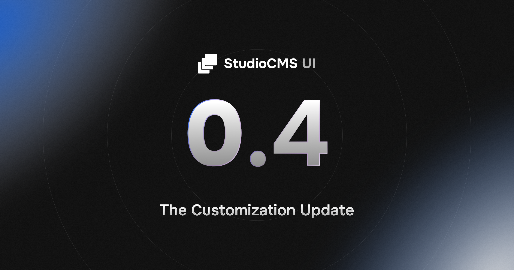

Hey all!

Welcome to **Pixel Perfect**, a series of blog posts where I dive into the design process behind websites I have created. No matter if SaaS-level landing page to personal portfolio, there's a story to tell for each of them, so let's dive into it!

Today, we're taking a look at [studiocms.dev](https://studiocms.dev), the home of StudioCMS, an Astro-native CMS for which I am a maintainer and the team's lead designer. We recently revamped the CMS's dashboard to look more modern, and created a UI library as part of that ([about which I wrote a blogpost!](/blog/building-a-ui-lib)). It became apparent fairly quickly that we would not be able to keep the current homepage as it had aged rather poorly and no longer reflected our brand design, besides having some other issues. I've created a [backup on the WayBackMachine](https://webcf.waybackmachine.org/web/20250118060937/https://studiocms.dev/), so you can look at the old version if you want to.

## Initial Ideas

Whenever I am asked to create a concept for a new site, I start taking little notes about things that come to mind. Usually, I let my mind wander when I'm bored or sleepy, so that's when I get most of my ideas. I have both a little notebook for physical note-taking and I also use [Obsidian](https://obsidian.md) to write down my thoughts. Once I feel I have enough ideas to start working on something, I usually draw up a sketch. For StudioCMS, we use an orbit-like design in the background of all marketing materials, so I wanted to feature them on the homepage in some way. Here's an image where you can see them in the background:



I also always create what I call a "set piece" for each homepage, something that looks cool and catches the user's eye. In most cases, it's a slightly animated background effect. Pleasant to look at but not too distracting. In some cases, it can also be a small animation that is featured as actual page content and conveys information. For this project, since I thought of the rings as orbits, I decided that stars rotating around on them might be a cool idea. Since we're an Astro-native CMS, we obviously want to create some association between us and Astro's branding, and since all of their material is space-themed, we decided to go with something similar as well.

If you're interested, here's the initial list of things I wanted to implement:

```
- Hero Section
	- ORBITS!
	- Starry bg with canvas (animated ofc)
	- npm install cta
	- Logo becomes Apollo on click
- Section about easy integration with Astro
	- Show code block (animated) with preview on the side, see Tailwind etc.
- Headful and Headless
	- integrate with any type of project
- Hybrid Rendered, serverless compatible 
- Auth / Roles
- Stats about downloads etc.
- Ecosystem
- Perfect for anyone from office worker to Astro dev
- Extensible with plugins
- Community support
- Blog section
- On-Page demo (find a sponsor to achieve per-user demo?)
- Basically, lots of interactive examples
- Mascot in some places
- Animations with Motion
```

Most of the time this list will get trimmed down during the design process, but it's always nice to have a starting point.

## All Pens in one Pot

Back in web engineering class, you prof might've told you to pen down your ideas on a piece of paper. At least, that's what mine did two weeks ago. To be completely honest with you, while scribbling down initial ideas is fine, you're going to want to step up your game with a tool like [Figma](https://figma.com) or [Penpot](https://penpot.app), an open-source alternative. They are amazing tools when it comes to prototyping your ideas on a proper canvas, with colors, proper styling and so forth. I recommend the latter, as Penpot is self-hostable, is open source and doesn't cost a penny. It may not be as good as Figma yet, but I'm sure it will get there.

## The *Hero* of the Story

The set piece is obviously a great start, but if we only had that, the initial thing you'd see on the site would be quite boring.

As you can see on the list above, another thing that came to mind was an `npm` command CTA (call to action). For those who don't know, CTAs are interactive elements on a webpage, usually buttons. Their goal is to get users to click on them, usually to sign up for something or try something out. Since StudioCMS has a command-line interface to create projects, a natural choice for one of the two CTAs was a little code snippet that told you how to get started with a new project quickly. From experience, whenever I (as a developer) am on a page, I want to quickly try something out instead of having to read endless guides and documentation, and I know a lot of other developers also feel this way.

The second CTA needed to be something for "normal" people. We market our CMS towards developers **and** marketers, so the best solution was to have a CTA for them as well. The difficulty in deciding what to link to was that we were not sure what a marketing person was looking for in a CTA. After a lot of debating, we decided we would feature an on-page live demo where people could try out the CMS without any coding experience, so that's what we put as the second CTA. 

Every page also needs a headline that conveys the meaning of the product you're trying to quote-on-quote "sell". While StudioCMS is an open-source project, we still want people to use it, so it's often quite helpful to think about your landing page as if you were selling a product. A common misconception about your headline is that it should feature the name of the product. However, since that will most likely also be shown in the navbar, you would end up with duplicate content, which isn't nice to look at. Besides, most people visiting your website and will have read the URL or the site title beforehand. In this case, I chose to go for something that incorporated our tag line, "**Astro-native**", and ended up with "The Astro-native CMS for all your needs."

The sub-header below the tagline is just as important as the headline. This is where you convey information that you could not fit into the initial "pitch" for your product, it can help explain what exactly the user is looking at. Outright stating what your product is is usually the best thing to put here.

## A Smooooooooth Transition

One of the things I find most difficult about the design process is the transition between hero section and the start of the other sections on the page. I'll admit, this is a flaw I usually introduce myself by having a set piece background, so I need some way of cutting it off without the user noticing. Here, I went for a fade effect into the normal background color to fade out the stars and orbits. Additionally, I added a video above the transition to make it less noticeable. Having a video in or right below your hero section is a nice way of keeping the user on your page. Our brain is trained to look at moving objects, so stuff like a video will keep the user on your page for longer. The real challenge is to make the video informative enough to keep marketers engaged while also showing off features in a way that everyone understands. At the time of writing, we have not finished the video yet, so you be the judge of how well we did.

## Divide and Conquer

Right below the transition is where the real flow of information starts. If the user gets to here, you've basically already convinced them to take a better look at your product. Now, the job is to keep their eyes trained on the content and convey useful information quickly. In the case of this website, we immediately start off with a grid targeting our main demographics: Marketers, Developers, Enterprises and Agencies. The secondary goal is to convert them to page interactions, so each of the cards in the grid targets a specific type of user and tries to get the to click on the associated CTA to learn more. As mentioned, the user is most likely already interested in the product, so our goal is to give them information that is helpful to them. Since we cannot fit all of that information onto the landing page, we need to divide up the user groups into their own sub-pages.

If we fail with the initial bit of information and the first CTAs targeting the user, we can assume that they need more information, so we'll continue to show them more detailed information about the product.

## Target Practice

When designing a website, it is always helpful to know who you are targeting with the contents. You should get to know the demographics you're trying to cater towards. For StudioCMS, as mentioned before, it's marketers and developers, however most of the time we will likely have either developers or experienced marketing directors on our page. I'd say we've done well enough to convert the classic tech bros with our dank hero section, and most marketers should've gotten caught at the previous grid, so now we're basically down to people who really want to know what StudioCMS is all about. It's now down to conveying technical details in a way that both (experienced) marketers and developers understand.

We start off by providing information about how StudioCMS can be deployed. This is usually critical information for developer teams, but if your marketing lead has been instructed to look for a CMS, they probably know what platforms to look for, so we put buzzwords in the headings here to quickly convey information:

### *Server* and *Serverless*

StudioCMS is compatible with both normal server environments and serverless solutions, which is a pretty important detail. The key term here is *serverless*. It acts as both a buzzword for humans looking to gain information about how to host StudioCMS, and as a keyword for search engines who are looking for details on StudioCMS that users are searching for. Below the subheading, we show off some brand icons that people might recognize, just to give them an idea of what it's possible to use with StudioCMS.

### *Headful* and *Headless*

Something I've recently come across is the debate between marketers of whether to choose a headful or headless approach. Not a lot of CMSs support both approaches right out of the box, and I believe it is one of the strong suits of StudioCMS, so it felt important to mention on the homepage. 

## One-Two Combo

At this point, we're pretty confident we've provided strong points to users about why they should use our CMS, so after the one-two-punch of supporting the most common hosting providers and both types of front-end, we now want to knock them out completely, metaphorically speaking. A good website is like an essay or a newspaper article, you're trying to tell a story and prove that you're right by providing valid examples and reasoning. When talking with the team, we agreed that the biggest strong suit besides the headful-headless combination was StudioCMS's plugin system, so our final big feature featured on the homepage will be exactly that. 

We put another interactive example here to grab the users attention again, as we want to make sure we don't lose their attention while they're scrolling down the page. A combination of video and moving text is pretty effective at this, although I really doubt it would knock out a boxer. Maybe that heading was a little misplaced, but I sure hope our interactive demo wasn't.

## Peer Pressure

We've now gone through the most important features, so all that's left is to pressure the user into actually using StudioCMS. The best way of doing that is to show statistics and social proof, and that's exactly what we do. 

We first do what I like to call a "hard-cut" by providing a full-width element with a different background color. This is meant to be a subtle nod to the user, saying "You've reached the end of this type of content". Within that banner, we start transitioning from technical details to social proof by showing off download stats, the amount of Discord members and the amount of GitHub Stars we've gathered.

Next is the actual social proof section, where community members have written messages to show off their opinion on why StudioCMS is great. It's a common technique to show off other people using and liking your product, it's what services like Trustpilot are built on. Essentially, they're a way to peer pressure users into using your product! If everyone else already uses it, why aren't you already?

## The A-B-C of StudioCMS

The next section is a clever little trick we've first employed on the [landing page of StudioCMS UI](https://ui.studiocms.dev). We call it the A-B-C of StudioCMS: three reasons why this library being a part of our ecosystem is a good thing. The short version: people like seeing that something integrates well with other things, it makes them worry less about if their existing setup will break when introducing your product into their workflow.

## Catching Crawlers

No, we're not going to look for grasshoppers and centipedes. The next section links over to our most recent blog article, as a way of telling web crawlers about the most recent thing happening in the ecosystem. This is less so for humans and more for machines, but maybe some people are interested in what's happening in the ecosystem. Either way, it can't hurt having a direct link to the most recent articles here.

## One Final Dance

At this point, the user has scrolled down the entire page and has basically reached the very end. It's now or never, if we don't get them to click on one of our CTAs now, we might lose them forever, so we put a card with some cool animations at the bottom to catch their attention, combined with a heading encouraging them to get started with StudioCMS. We also use the same CTAs from the start of the page to offer them a little callback to the start of the page, reminding them of the long way they've taken to get here.

Last but not least, we mention explicitly that StudioCMS is free, open source software and show off our sponsors, pretty much the last guard against the end of the user's journey, the footer. Maybe they'll recognize a brand here which makes them think that if the brand trusts us, they can to.

If the user reaches the footer, they get one last surprise: our mascot, Apollo, following their mouse with his eyes. If they've managed to get down here without clicking a single CTA, we want to create a lasting impression, and an animation that follows your cursor is certainly a way of doing that.

## Afterthoughts

You've made it to the end! Let's summarize what we've learned this time. For one, it's incredibly important to collect lots of ideas. You may not end up using all of them (as you can see from what was actually implemented out of the things from my list), but it's nice to have ideas to bounce of. When creating a page, your goal is **always** to get users to click something, to get them to use your product, or read more about you. CTAs are the way to do this. Think about what type of user might visit your page, what they are looking for, what they might be interested in. Call them by name if you have to! "For Marketers" is incredibly effective when a marketer visits a page. Imagine them going "Oh hey, that's me, I'm a marketer!". Also, don't forget to always show useful information. I recently watched [an incredible video by YouTuber Malewicz](https://www.youtube.com/watch?v=HnTv9J9RYrw), where he (in part) talked about how modern designs have become meaningless. That was a big wake-up call to me, and I tried my best with this site to convey meaningful information, and you should try the same! Yes, buzzwords are nice, but they're useless if nobody can tell what your product is actually about. Last but not least, never forget your social proof. Be it numbers or quotes from people, even both! Peer pressure is quite effective at converting users 😉

Alright, I'll leave you be now. Thanks for checking out this post! If you want to read more, there's a blogpost I recently wrote about [what building a UI library has taught me](/blog/building-a-ui-lib).

Until next time!