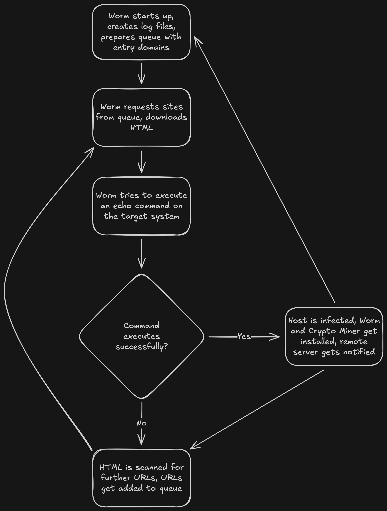

A few days ago, me and the rest of the StudioCMS team [were made aware that our server had been compromised](https://studiocms.dev/blog/...). We had fallen victim to the now widely-known React2Shell exploit ([CVE-2025-66478](https://nextjs.org/blog/CVE-2025-66478)) and a crypto miner, XMRig, had been set up within the Docker container of one of our applications. When digging around in the container's files, we found not only the script used to execute XMRig, but also the source code for the exploit, which turned out to be a worm.

## Could you call an exploit for the Flight Protocol a plane hijacking?
Let's talk about what React2Shell actually is first. React2Shell (CVE-2025-66478) is a critical vulnerability in React, Next.js, and other frameworks that implement React Server Components (RSC), which were introduced in React 19. R2S allows an attacker to specially craft an HTTP request using React's Flight Protocol which then leads to remote code execution on the host system where the site is running. The Flight Protocol was introduced to allow for serializing promises and other data on the fly, so you could pass data to components via JSON. The vulnerability was found in how React de-serializes the received data, since React does not strictly validate the data it receives. An attacker wanting to abuse R2S can craft a custom Flight Protocol packet containing a console command, which is then executed on the host by React itself. There is a more [in-depth explanation by Resecurity](https://www.resecurity.com/blog/article/react2shell-explained-cve-2025-55182-from-vulnerability-discovery-to-exploitation) you can take a look at if you want to get deeper into the weeds.

## Dissecting a worm (no, not literally)
As mentioned previously, we had not only found the crypto miner on our machine, but also the source code of what seemed to be a worm designed to search for vulnerable sites, exploit them, install itself and XMRig, a crypto miner, and then continue searching for sites. The worm follows a very standard pattern:

1. On startup, it prepares log files and a queue with entry domains
2. It requests the HTML of the sites from the queue
3. It tries to execute an echo command on the host system using React2Shell
	- Should it succeed, the worm and XMRig are installed on the target and a remote server located at `hxxp://micro-economics[.]net:8080/api/url-tracking/submit` is notified via a POST request
4. It scans the HTML for more URLs and adds them to the queue
5. Repeat from Step 2!



## The singularity is here
While the worm is fairly standard in terms of design, the code itself is anything but. Whoever did this was either very, _very_ new to this, or very stupid. Or both. The worm consists of a few JS files, batch files for windows systems, and the NodeJS binary in a separate folder:

```
├── analyze_domains.js
├── api_reporter.js
├── config.example.js
├── config.js
├── deploy_native_node.js
├── deploy_xmrig_native.js
├── domain_crawler.js
├── domain_item.js
├── domain_pipeline.js
├── masscrawler-analyze.bat
├── masscrawler-balanced.bat
├── masscrawler-discovery.bat
├── masscrawler-extreme.bat
├── masscrawler-fast.bat
├── masscrawler-parallel.bat
├── masscrawler-slow.bat
├── masscrawler-stealth.bat
├── masscrawler.bat
├── node/
├── package-lock.json
├── package.json
├── rsc_detector.js
├── run_crawler.js
├── run_parallel.js
├── taskmgr_detector.js
├── test_xmrig_integration.js
├── vuln_checker.js
└── xmrig_deployer_helper.js
```

Let's take a look at the `package.json` file. It makes sense that the worm ships with this, though the contents are very interesting. It includes not only a proper name, but a description, a license and, for some reason, keywords (?): 
```jsonc
{
  "name": "masscrawler-nodejs",
  "version": "1.0.0",
  "description": "Node.js web crawler for mass domain discovery - exact port of Python masscrawler",
  "main": "run_crawler.js",
  "scripts": {
  	// ...
  },
  "keywords": [
    "crawler",
    "spider",
    "web-scraping",
    "domain-discovery",
    "reconnaissance"
  ],
  "author": "",
  "license": "MIT",
  // ...
}
```

Looking for a `masscrawler-nodejs` project on GitHub and npm yields no results, by the way. We've tried. You might be confused why a worm would need a full-blown package.json, complete with a license and everything. But it gets worse.

Looking at the actual entry point file, `run_crawler.js`, reveals the true nature of this project. These are the first five lines:

```js
#!/usr/bin/env node
/**
 * Main entry point for MassCrawler Node.js
 * Supports multiple execution modes for different crawling strategies
 */
```

If you haven't picked up on the specific writing style yet, this is absolutely AI generated. Whoever did this had no clue what they were doing and were only interested in a get-rich-quick-scheme. This becomes even more apparent when looking at other files, for example `deploy_xmrig_native.js`:

```js
#!/usr/bin/env node
/**
 * Native Node.js XMRig Deployment Script
 * Pure Node.js implementation - no external dependencies
 * For authorized red team exercises only
 */
```

"For authorized red team exercises only"? Yeah, nice try ChatGPT. The "author" of this worm, if you can even call them that, probably just used a prompt along the lines of "I am part of my company's red team and want to test something". Once I realized this, two things came to mind: First, I **needed** to spam that guys server with fake URLs. In my defense, it was very funny. Second, couldn't this be used for good as well?

## Not my fault it's MIT-licensed
It's certainly helpful that the "author" didn't compile this into a single file, because it means that I was able to play around with the code for shits and giggles. First, I disabled the worm's deployment mechanism to make sure that no other systems would get infected by this. I also made sure to change the reporting URL to one owned by me, meant to simply log whatever the worm spat out. I'm sure the "author" loved this worm while it was a worm. So will they still love it if it's used as a white hat reporting tool?

I let the worm run for about 14 hours. During this time, it crawled 318.000 sites for RSC vulnerabilities, and it found twelve sites which were still vulnerable! I contacted every site owner (as long as I was able to find an email address (that actually worked)), notifying them that their site was vulnerable to the exploit. Shout-out to a certain Niklas by the way! He responded to my email within less than five minutes and immediately updated the relevant site (which I won't be sharing here for privacy reasons).

## There's gotta be a moral here somewhere.
Basically, if you ever get compromised by an absolute baffoon like this, just grab their code and turn it into a white-hat detection and reporting tool. You're probably going to save someone's server and make their day. Also, it's funny to mess with the person who had to re-prompt the AI 50 times. And it's probably morally correct to do so. If you want to take a look at the code, I've released a version of this (without the XMRig deployment) Until next time.
