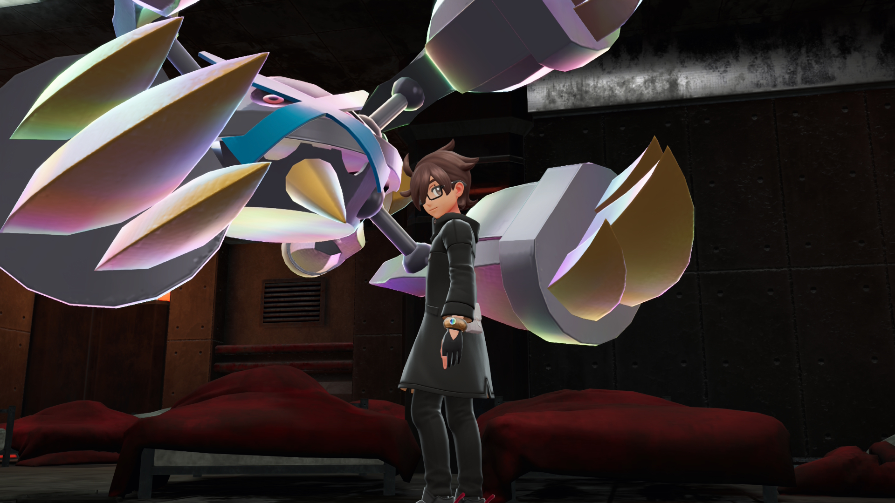
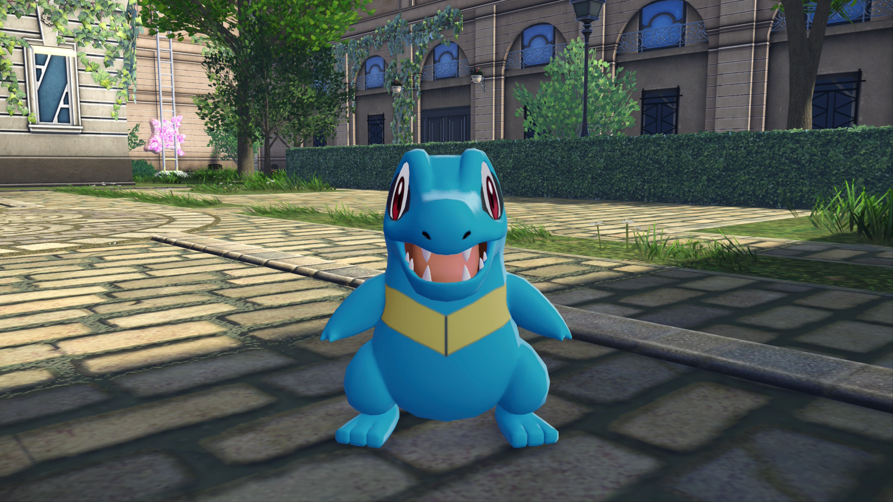
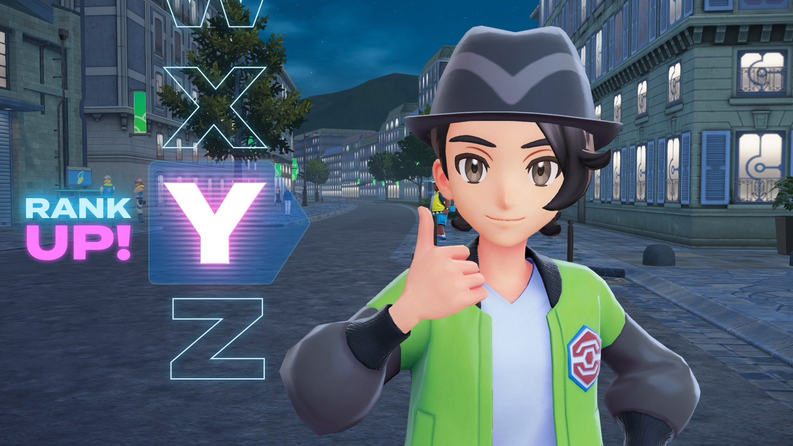
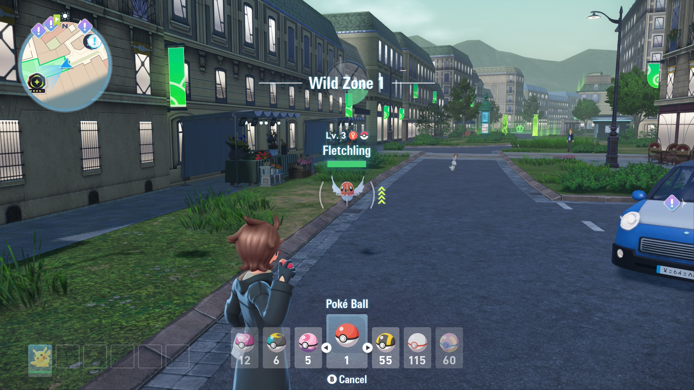
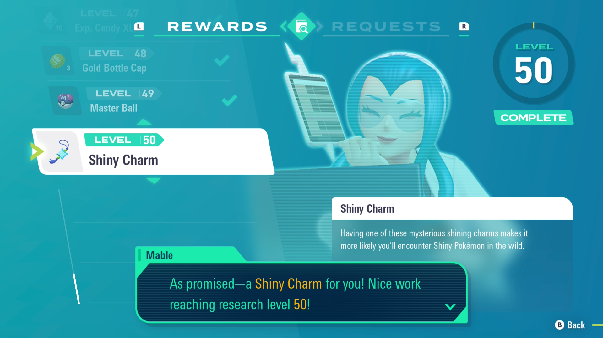
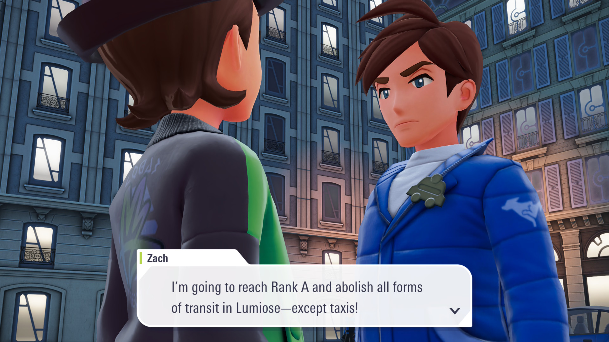
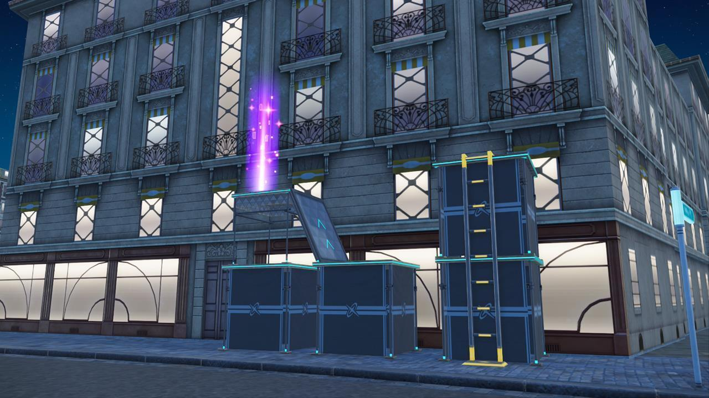
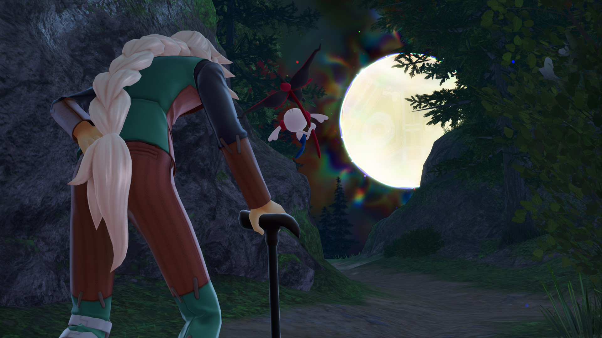

import { YouTube } from 'astro-embed';

I've always been a Nintendo/Pokémon kid. One of the first games I ever played was Pokémon Alpha Sapphire for the Nintendo 3DS (in my case, a red Nintendo 3DS XL, my first ever console), and I instantly fell in love. I still own and play that game to this day, recently having started a new playthrough on my New Nintendo 2DS XL. The region the game is set in, Hoenn, is still my favorite region. Metagross is still my favorite Pokémon, and I shiny hunt for it in every game I play. But not for the default form.

The "gimmick" of Pokémon Alpha Sapphire and Omega Ruby was "Mega Evolution". For those who are unfamiliar, every Pokémon game since the second generation of the games has had a new feature added to keep the experience from being too similar to the last game. First, Pokémon were able to hold items. In generation three (Pokémon Ruby and Sapphire, the remakes of which became my first ever Pokémon experience), double battles were introduced. Next came online play, then triple battles. Generation six introduced "Mega Evolution". Normally, a Pokémon can evolve a certain number of times based on various conditions like their level, a high friendship with their trainer, or via an item. Mega Evolution is different. It's a temporary power boost that you can trigger by giving your Pokémon a so-called "key stone", then mega evolving it while in a battle. After the battle, your partner changes back into it's normal form. GameFreak really went out of their way for this one. Not all Pokémon could mega evolve, but those who were able to received new appearances to match their powered-up state. And the community loved it. 

I did say it was my favorite (Mega) Pokémon...

Ever since generation six (Pokémon X and Y) and the remakes of Pokémon Ruby and Saphhire, Mega Evolution had been dropped in favor of different gimmicks. Not that the fans moved on, they still dreamed up mega evolutions (or "megas") for their favorite Pokémon that never received them in the two games the feature was around. But after the release of the Ruby and Sapphire remakes (OR/AS for short) in 2014, GameFreak and Nintendo seemingly moved on. So imagine everyones surprise and excitement when a new Pokémon game in the same region as Pokémon X and Y was announced. Lumiose City, the capital of Kalos and the Pokémon equivalent to Paris, the region from X and Y, was officialy revealed to be the place the game would take place. The name of the game? Pokémon Legends: Z-A.

<YouTube id="uq-Znr_jGIg" posterQuality="max" title="Pokémon Legends: Z-A releases simultaneously worldwide in 2025!" />

Speculation around this time went rampant. The first Pokémon Legends game, Pokémon Legends: Arceus, was a spin-off set in the distant past of the Hisui region. It was the first game that featured free-roam Pokémon catching, where you wouldn't even have to enter a battle before being able to collect your favorite creatures. It featured Dark Souls-like boss battles, a gripping story and an interesting look at the early history between humans and Pokémon. I didn't play the game myself because I was put off by the graphics, which I felt looked interesting, but not exactly flattering, same as the framerate (no doubt a byproduct of the original Nintendo Switch starting to struggle as it got older). So when the first official extended look at the game was released a few months later, everyone (including myself) was bursting at the seems with excitement. Here is that trailer so you can experience it for yourself:

<YouTube id="M_KNDtKJJ-8" posterQuality="max" title="An Extended Look at Pokémon Legends: Z-A!" />

There it was. Decent-looking graphics, an open world city to explore, AZ, the 3000 year old man from the X and Y games, the same catching and movement mechanics from Legends Arceus. Most importantly though, for the first time in franchise history, Pokémon battles would not be turn-based. Instead, you'd command your partner in real time, move around alongside them on the battlefield, dodge attacks and attack in turn. I was sold already, this was amazing. And then they casually mentioned Mega Evolution returning as the gimmick. I'll skip you the excruciating wait I and everyone else had to go through until the game eventually released 8 months later. I will mention that a few new Mega Evolutions were shown off, but I tried not to get myself spoilered. So let's dive into the game, shall we?

This is the view you're first greeted with. Not bad I'd say!

The first hour of Legends Z-A feels more like a scripted cutscene than an actual game. You'd think Hideo Kojima had his hands on this. First, you get to create your character by choosing a gender, a hairstyle and some makeup. After that, a small cutscene of your character showing them on a train to Lumiose City plays, with _something_ jumping into your open bag. You get off at the Gare de Lumiose (the train station) and the hand holding commences. You meet either Taunie or Urbain based on the gender you picked (fun fact: Taunie and Urbain are both plays on the word "town"!) and they ask you to shoot a video for their hotel as a promotion. Before you can get started, the two of you get distracted by an advertisment from Quasartico Inc., the company which has been tasked with carrying out Lumiose Citys ambitious redevelopment plan, a byproduct of the story of the X and Y games which I won't get into. After the cutscene, a small Pokémon steals your bag, leading you to the inevitable choice between your three starter Pokémon and your first battle. Normally, this is where a Pokémon game would give you your Pokédex, some story beats about the region, point you in a direction and you're off to the races. Not here. Instead, you are thrown into a few more cutscenes to meet your rivals of the game (Taunie/Urbain, Lida and Naveen), AZ (who is the owner of the aforementioned hotel), a tutorial on how to climb up and jump down buildings, the "Wild Zones" in which you can freely catch Pokémon, a tutorial on catching, rolling to avoid attacks, the Pokémon professor who (finally) gives you your Pokédex then yet another character from the main cast. You think you're done? Wrong. Head back to the hotel (with the open source world blocked off by "You really should head to the hotel" imaginary walls), more cutscenes, an introduction to the games day-night-cycle, more battling, an introduction to Pokémon centers, your first rank-up fight, another character, and finally, _more fucking cutscenes_. It's honestly incredible how an open-world game manages to be so untrusting of the player.

Totodile, the starter I picked! Not a thought behind those eyes.

During the previous rant, I mentioned a couple concepts I have not properly talked about yet. First, a lot of characters (like AZ or Mable, the Pokémon professor) return from X and Y or have ties to characters from those games (like Lida, one of your rivals, who is the sister of Tierno, a rival from X and Y). The attention to detail is pretty cool, especially if you're a little more invested in the lore of the games. Second, all around the city, Quasartico Inc. has built "Wild Zones", little patches of the city encased by hologram barriers. Within these zones, you can battle and catch wild Pokémon. Not that they don't free-roam within the city, there's lots of creatures to catch even while running around the bigger streets. But those zones give you the option to catch the more elusive creatures. Third, the day-night-cycle, battles and ranking up. The game's premise is that you have to save the city from Pokémon which are undergoing a phenomenon called "Rogue Mega Evolution". Under normal circumstances (and according to the lore), a Mega Evolution is only possible because of the bond between a Trainer and their Pokémon. These Pokémon however seem to mega evolve without a trainer, and it seems to cause them great pain. To prove to AZ and the folks over at Quasartico Inc. that you are strong enough to handle these dangerous creatures, you need to participate in the Z-A Royale, a tournament to decide who the strongest trainer in the entire city is. Every night, in addition to the Wild Zones, temporary Battle Zones appear in which you can battle other trainers for prize money and points. Once you accumulate enough points, you receive a "Challengers Ticket" which allows you to battle a particularely strong Trainer the same rank as you. Once you defeat them, you rank up, for example from Rank Z to Rank Y. That's also where the name of the game comes in: Make your way from Rank Z to Rank A.

Long way to go still! 

With all of that setup out of the way, let's get to the rating part. I'll start with the gameplay loop. Generally, you'll head to a Pokémon center with the money you aqcuired from a night of batteling. You buy some healing items and Pokéballs, then prowl through the various Wild Zones during daylight to catch new Pokémon, fill out your Pokédex, complete side missions and quests from Mable. Once it turns night again, you head into a Battle Zone, fight trainers to earn points and eventually a Challengers Ticket, then participate in your rank-up battle and advance the story by a bit, which usually means you need to calm more Pokémon which have undergone Rogue Mega Evolution, after which you receive the Key Stone for that Pokémon. While roaming the city, you can pick up some items and "Colorful Screws", the latter of which you can trade in for various benefits. I'd say this is generally well executed.

Catching is fun, doesn't get repetitive and you can sneak into higher-level zones for a bit of a challenge. Filling out the Pokédex is fun, you get some Points with Mable for fulfilling her challenges which in turn gets you research rewards, which then help you in your further catching and battling.

I have two of these in Shiny by the way!

The quality of the side quests unfortunately varies greatly. Some are absolute masterpieces with story-relevance where main characters appear and you resolve a conflict or help some NPC with a problem. Other quests boil down to "Fetch me 20 Berries, go", which sucks. Especially when there's 119 of them, even more if you include the DLC.

Mable's research requests fall prone to the same issues. Some are easy enough to complete, and most will actually resolve themselves if you just play the game. Mable's requests are however the only way to get the Shiny Charm, an item that is basically _required_ to hunt for the rare different-colored variants of Pokémon as it improves your chances of finding them drastically from one in 4096 to one in 1024. Before the DLC for this game released, you had to complete literally every single one of these requests, one of which was to participate in **one thousand battles**. During the main story, you'll maybe participate in 300 - 400 of these, making the other 600 an absolute grind. Being the psychopath that I am, I of course wanted to get the shiny charm. But even with super-efficient strategy for extra quick battles, it still took me around 20 hours to complete this quest (Three battles approximately every 2 minutes and 10 seconds meant **21 hours 40 minutes of grinding**). Needless to say, this was grusome. GameFreak even remedied this with the release of the DLC which introduced a couple new research requests so you didn't have to do all that for just the shiny charm. Still a bit ridiculous, considering the DLC costs around 30€, but better than nothing.

I wasn't sure whether I should be happy or depressed.

On a more positive note, the new battle system is a blast. Battle zones change location every night, with around 10 possible locations around the city. Once you're in a zone, you can get a drop on the other trainers by sneaking up and attacking first, giving you a free move and extra damage against them. The battle itself is really fun to play out, with you being able to command your Pokémon to move to specific places, running away from moves to dodge them or even tactically switching out your Pokémon to avoid taking damage. Some of the moves are really broken in this game, especially area-of-effect ones like Earthquake, since they are able to hit a lot of targets at the same time. When I was at Gamescom in August, I got to play a demo of the game, and it was very difficult for me to get adjusted to the battle mechanics within the 10 minutes I had. I am however happy to report that, with a little more time, the battle system becomes very intuitive and fun to control. The rank-up battles are also fun, though for me they didn't feel very challenging as I usually grinded through an entire challengers ticket within a single night and gained enough levels to be on equal footing with them. Also, each of them has their own quirky personality and a few one-liners which are pretty funny.

Sure hope the redevelopment plan didn't include a subway.

The battles to calm down the Rogue Megas are the highlight for me. Every fight has a different main attack you need to dodge, the new Mega Evolutions look incredible and even old mega evolutions look great in HD. I won't spoil any of the battles here, but I think this part of the game is very well executed. The DLC even introduces more of these battles and allows you to re-fight them under certain circumstances.

The free-roam in the city is alright. It's a lot of ground to cover, with a lot of NPCs scattered around to make the city feel lived in. You can see their Pokémon around them too, so you don't feel like the only trainer with actual partners like you used to in the older games. The Colorful Screws I mentioned earlier are placed throughout Lumiose, meaning you have a nice distraction to work towards whenever you spot their signature glow. They are usually placed on scaffoldings, meaning you have to complete a little parkour challenge to get to them. It's nothing special, but it breaks up the gameplay loop well enough to not become repetitive. You can trade them in for plushies that grant you benefits like earning more money from battles, making it easier to catch wild Pokémon or making it more difficult for Wild Pokémon to knock you out in Wild Zones. The only greivance I have is that there's a whopping 100 of them, and that you have no way of tracking them, meaning you'll have to follow an online guide if you don't want to spend multiple hours exploring every nook and cranny of Lumiose.

At least they're easy to notice once in your field of view.

Something that I really like about this game is the story. Sure, it does follow the usual ark, and the new characters are a little flat, but old characters like AZ who already have a deep lore are respected and well-written, with their actions and dialogue making sense and not feeling out-of-character. The overall story beats are fine, the pacing feels fine and the final hours of the game really got me hyped and even a little sad towards the end. I'm hoping this will be the baseline for new Pokémon games, but who am I kidding, this is very much riding on the lore of previous installments.

While the story is good, this game continues the unfortunate Pokémon tradition of having the mouths of characters move realistically without having voice acting. I'm not sure how this keeps happening, but it *needs* to change. Even The Legend of Zelda made the jump almost a decade ago, Pokémon is the most valuable media franchise ever and the Anime has voice acting, I'm not sure what the problem here is.

I've touched on the DLC a few times during this review. If you're a fan of the grindy nature of the challengers tickets, you're in luck! The "Mega Dimension" DLC brings them and Wild Zones back, in a weird combination of tasks you need to fulfill within pocket dimensions. At the time of writing, I have not fully completed the DLC, but I have the base game at 100% and have played around 100 hours. If you don't mind the 30€ and more grinding, it's worth getting as it provides worthwhile improvements for hunting Shiny Pokémon, extra quests, more Key Stones and Mega Evolutions and quality of life additions, plus a neat little story that expands on the characters from the base game.

Time to sum this up! Pokémon Legends: Z-A is a very fun experience which feels very close to what a young me would've wanted from a Pokémon game, but it's hindered by the grindy nature of quests, collectibles, story progression, shiny hunting and the missing voice acting for any and all characters. The graphics are a bit mediocre, possibly a byproduct of this game launching on both Switch 1 and 2, but the Switch 2 edition had no performance issues and quick load times, if any.
